# ✈️ Turbofan Engine RUL Predictor
### Predicting Jet Engine Failure Through Machine Learning


> An **AI4ALL Ignite** group project by **Team 04C**. We train a model on turbofan
> sensor telemetry to predict a jet engine's **Remaining Useful Life (RUL)** — how
> many flight cycles remain before failure — so airlines can move from *fixed*
> replacement schedules to **predictive maintenance**.

**🔗 Live app:** **[jet-engineml.streamlit.app](https://jet-engineml.streamlit.app)** &nbsp;·&nbsp;
**📊 Presentation:** **[Slide deck](https://docs.google.com/presentation/d/1QzA9PUvuROwUNfxtLUXaczG4m1Damv83/edit?slide=id.p1#slide=id.p1)** &nbsp;·&nbsp;
**▶️ Reproduce it:** **[Colab notebook](https://colab.research.google.com/drive/1qzrg2iQnuTor42PjmQoMWagofw3uq6xi?usp=sharing)**

**🏆 Deployed model:** **LSTM** — **RMSE 16.19 ± 0.35 / MAE 11.59 ± 0.53 / R² 0.850** on
unseen engines, selected over Linear Regression, Logistic Regression and Random Forest across
**[five documented rounds of training](#-model-selection-five-rounds-of-training)** and
**[verified on three independent machines](docs/reproduction-log.md)**.

---

## 📑 Table of Contents

1. [The Problem](#-the-problem)
2. [Dashboard](#-dashboard)
3. [System Architecture](#-system-architecture)
4. [The Dataset](#-the-dataset)
5. [Data Audit](#-data-audit)
6. [Exploratory Data Analysis](#-exploratory-data-analysis)
7. [Modeling Approach](#-modeling-approach)
8. [Model Selection: Five Rounds of Training](#-model-selection-five-rounds-of-training)
9. [Results](#-results)
10. [How the Dashboard Works](#-how-the-dashboard-works)
11. [Getting Started](#-getting-started)
12. [Project Structure](#-project-structure)
13. [Design Decisions](#-design-decisions)
14. [Limitations & Future Work](#-limitations--future-work)
15. [The Team](#-the-team)
16. [Acknowledgments & References](#-acknowledgments--references)

---

## 🛩️ The Problem

Jet engines are today maintained on **fixed schedules** — replaced or serviced after
a set number of flight cycles, whether or not they actually need it. That is safe but
wasteful: healthy engines get pulled early, and the occasional engine degrades faster
than the schedule assumes.

**Research question:** *Can machine learning predict early engine failure from sensor
telemetry, to support predictive maintenance and reduce unexpected downtime?*

If we can estimate an engine's **Remaining Useful Life (RUL)** — the number of flight
cycles left before failure — from its sensors, maintenance can be scheduled *per
engine, by condition*, instead of by a one-size-fits-all calendar. This project builds
that estimator and wraps it in an interactive dashboard.

### What the sensors are actually measuring

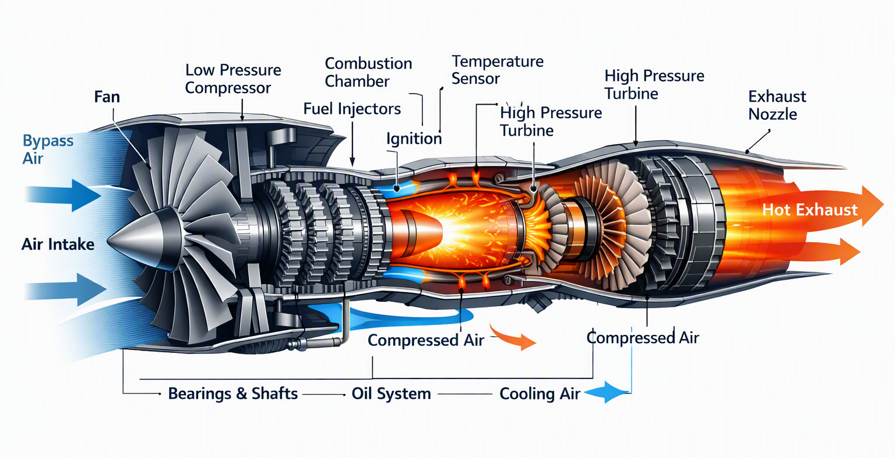

<sub>*Schematic illustration, simplified and not to scale — a real turbofan also has a high
pressure compressor and a low pressure turbine, and its sensor placement differs. Included to
show the airflow path the sensors sample, not as an engineering reference.*</sub>

A turbofan pulls air in through the **fan**, compresses it, burns it with fuel in the
**combustion chamber**, and drives **turbines** with the hot exhaust. The 15 sensor channels
in our dataset are temperature, pressure, fan/core speed and flow readings taken at points
along this path.

That physical picture is why the degradation signal exists at all: as an engine wears, seals
loosen and blades erode, so the compressor must work harder for the same thrust. Core
temperatures creep up and pressure ratios drift — slowly at first, then sharply near failure.
**The models never see a temperature in °C; they see that drift**, z-scored, one cycle at a
time (Linear/RF) or thirty cycles at a time (LSTM).

---

## 🖥️ Dashboard

The Streamlit app has three modes. Each prediction is served by the **LSTM** when the engine's
history is available, and by the **Random Forest** when it isn't — and the UI says which.

> ### ▶️ **[Try it live → jet-engineml.streamlit.app](https://jet-engineml.streamlit.app)**
> The LSTM checkpoint ships with the repo; the Random Forest is trained on startup from the
> committed dataset. No setup required.

### 1. Browse engine
Pick one of the 100 training engines and scrub through its life cycle by cycle, watching
its predicted RUL update. Below, engine 1 at its final cycle (192) is correctly predicted
at just **4 cycles** of life remaining:

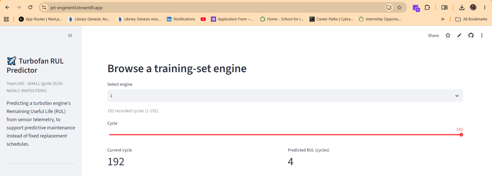

The sensor charts show the characteristic upward drift near failure — the degradation
signal the model keys on:

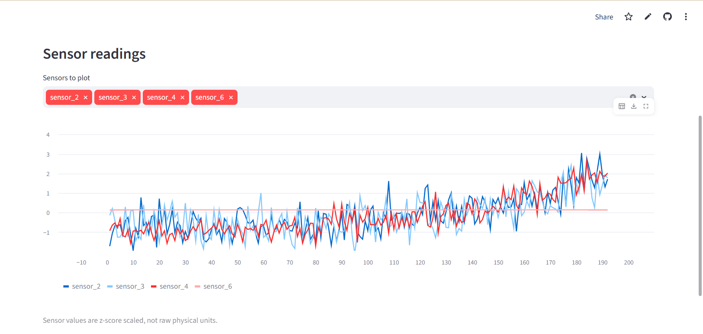

### 2. Upload CSV
Upload pre-scaled sensor readings; the app validates the 16 required columns and previews
the data:

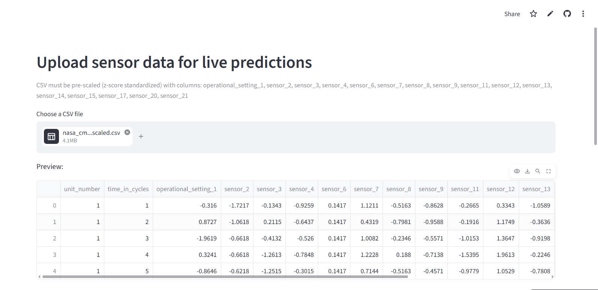

…then returns a predicted RUL for every row, downloadable as a results CSV:

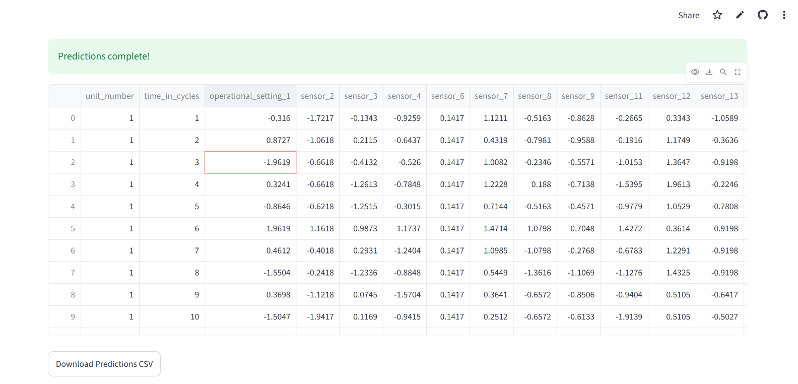

### 3. Manual input
Hand-enter a single engine's 16 sensor/setting values for an instant prediction with a
color-coded maintenance recommendation (🟢 healthy / 🟠 inspect / 🔴 maintenance soon):

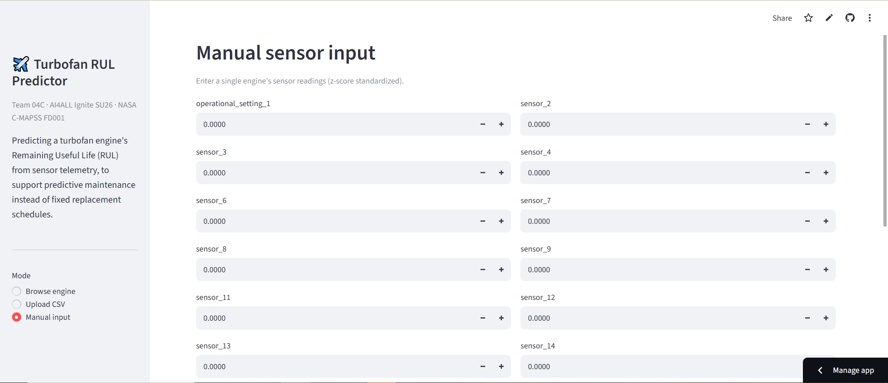

> ⚠️ **This mode is served by the Random Forest, not the LSTM** — and that is a genuine
> limitation of sequence models, not an oversight. The LSTM predicts from a *trajectory*: it
> needs the last 30 cycles to see how fast sensors are drifting. A single hand-entered
> snapshot has no history, so only a model that reads one cycle at a time can score it. The
> app states this in the UI rather than silently downgrading the prediction.

---

## 🏗️ System Architecture

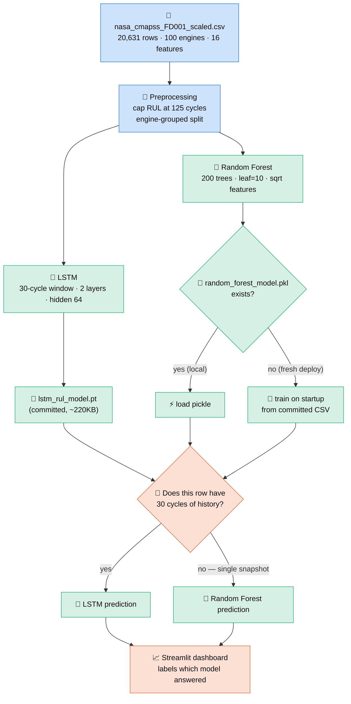

### Why the deployment ships *both* LSTM and Random Forest

This is a deliberate design choice, not indecision — the LSTM is our best model, but it can't
answer every kind of question a user asks. We ship both and **route each prediction to the
model that can actually make it**. Three reasons drive this:

**1. A sequence model needs a sequence.** The LSTM reads a **30-cycle window** to see *how
fast* an engine is degrading — that trend is exactly what makes it more accurate. But that
also means it **physically cannot score a single row**: with no history, there is no trend to
read. The Random Forest, by contrast, predicts from one snapshot of 16 sensors. So the two
models cover complementary inputs:

| The user provides… | Model used | Because |
|---|---|---|
| An engine's history (Browse mode; CSV with `unit`+`cycle`) | 🧠 **LSTM** | 30+ cycles available → it can read the degradation trajectory |
| A lone snapshot (Manual input; CSV without engine/cycle) | 🌲 **Random Forest** | no history exists → the LSTM can't run, RF scores the single row |

**2. Accuracy — use the better model whenever possible.** The LSTM (**RMSE 16.19 ± 0.35**)
beats the Random Forest (**RMSE ≈ 18**), so the app hands *every* history-bearing prediction to
the LSTM and only falls back to RF when it has no choice. The UI always **names the model that
answered**, so the headline accuracy is never implied for a prediction it doesn't apply to —
honest disclosure over a prettier single number.

**3. Robustness & self-sufficiency on deploy.** Keeping the Random Forest also gives the live
app a **safety net**: `torch` is a heavy dependency, and if it or the checkpoint ever fails to
load on the free tier, the dashboard still serves predictions via RF instead of crashing.
Storage-wise the two models fit their roles neatly — the LSTM checkpoint is only ~220 KB so it
is **committed directly**, while the ~28 MB Random Forest pickle is gitignored and **retrained
on startup** from the committed CSV. No external files, no manual steps — clone and run.

> **In one line:** the LSTM is the star (used for every real trajectory), and the Random Forest
> is the utility player — it covers single-snapshot inputs the LSTM can't, and backstops the
> deployment if torch is unavailable.

---

## 📊 The Dataset

We use **NASA's C-MAPSS FD001** turbofan degradation dataset — a standard
run-to-failure benchmark in prognostics. Each engine runs from healthy operation until
failure, logging sensor readings every flight cycle.

| Property | Value |
|---|---|
| Rows (engine-cycles) | **20,631** |
| Engines (units) | **100** |
| Cycles per engine | 128 – 362 |
| Model features | **16** (1 operational setting + 15 sensors) |
| Target | `RUL` — cycles until failure |
| Scaling | all features **z-score standardized** (not raw physical units) |

### Data dictionary

| Column | Meaning |
|---|---|
| `unit_number` | Engine ID (1–100) |
| `time_in_cycles` | Flight cycle index for that engine |
| `operational_setting_1` | Flight-condition setting (scaled) |
| `sensor_2 … sensor_21` | 15 retained sensor channels (scaled): temperatures, pressures, fan/core speeds, flow ratios |
| `RUL` | **Target** — remaining useful life in cycles |

> ⚠️ **Values are z-scored**, so a reading of `1.4` means "1.4 standard deviations
> above the fleet mean," *not* a temperature or pressure. All UI copy says "scaled
> sensor reading" rather than °F/psi. Uninformative/constant FD001 channels (sensors
> 1, 5, 10, 16, 18, 19) were dropped upstream.

---

## 🧪 Data Audit

Before trusting a single model result, we audited the dataset. Everything below is produced by
[`scripts/audit_data.py`](scripts/audit_data.py) — run it yourself:

```bash
python scripts/audit_data.py
```

It exits non-zero on any integrity failure, so it can gate a pipeline rather than just inform
a human.

### 1. Integrity — clean on every check

| Check | Result |
|---|---|
| Missing values | ✅ **0** across 20,631 rows × 19 columns |
| Duplicate rows | ✅ **0** |
| Non-numeric / malformed columns | ✅ none |
| Constant or dead feature columns | ✅ none |
| Cycle continuity | ✅ every engine runs `1, 2, 3 … N` with **no gaps** |
| Label consistency | ✅ `RUL == max_cycle − current_cycle` for **all 100 engines** |
| Run-to-failure | ✅ every engine reaches RUL = 0 |

Zero label errors across 20,631 rows is unusual and worth stating plainly — it reflects that
FD001 is a curated NASA benchmark, not scraped data.

The uninformative FD001 channels (sensors **1, 5, 10, 16, 18, 19** — constant or pure noise)
were already dropped upstream, which is why 16 features remain rather than 24.

### 2. Outliers — kept deliberately

**0.148%** of readings sit beyond 6 standard deviations (max |z| = 8.12). We did **not** remove
them. Those extreme values are engines close to failure — they *are* the signal the project
exists to detect. Clipping them would have deleted the target phenomenon.

### 3. Split representativeness

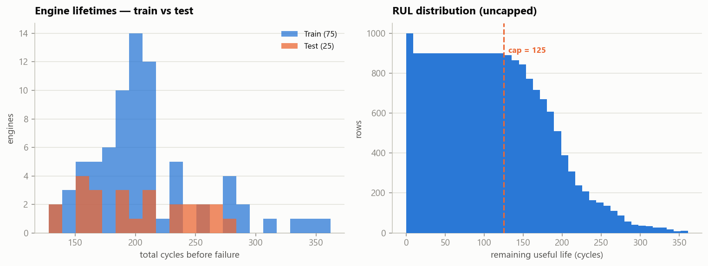

| | Engines | Mean lifetime | Median |
|---|---:|---:|---:|
| Train | 75 | 208 cycles | 199 |
| Test | 25 | 202 cycles | 195 |

The test engines' lifetimes differ from the training set's by **2.5%** — the hold-out isn't
accidentally made of unusually short- or long-lived engines. The shortest engine in the whole
dataset is **128 cycles**, comfortably above the LSTM's 30-cycle window, so no prediction ever
relies on padding.

### 4. Class balance

**15.0%** of all rows are within 30 cycles of failure. This imbalance is why we report
**F1 and PR-AUC** rather than leaning on accuracy — a model that never raises an alarm would
still score 85% accuracy while being worthless.

> **Why the Results section says 17.9%:** that figure is measured on the *scored* subset (test
> engines, cycles ≥ 30). Filtering out early-life cycles removes negatives only — the positive
> count is fixed at exactly 31 rows per engine — so the *rate* rises while the *count* doesn't.
> Both numbers are correct for their population.

### 5. ⚠️ One disclosed issue: the scaler saw the test engines

The dataset arrived **pre-scaled**, and the audit shows the z-scoring statistics were computed
over **all 100 engines** rather than the 75 training engines alone:

```
global mean (all 100 engines): +0.00000000   ← exactly zero
train-subset mean            : -0.00023      ← would be exactly zero if fit on train only
```

This is **preprocessing data leakage**. Strictly, a scaler is part of the model and should only
ever see training data.

**How much it matters — honestly, very little here:**

- It leaks **aggregate sensor statistics** (a mean and a standard deviation), **not labels**. No
  RUL information crosses the split.
- The magnitude is negligible: a train-subset mean of −0.00023 instead of 0.
- It affects **all four models identically**, so the model *comparison* — the actual finding of
  this project — is unaffected.

It could make the absolute error figures a hair optimistic. It cannot change the ordering
LSTM < Random Forest < Linear.

We are not silently fixing this: correcting it properly requires the raw NASA FD001 files (we
hold only the scaled CSV), refitting a `StandardScaler` inside the training fold, and re-running
all five rounds. We judged that a poor trade for a sub-0.001 shift, and disclosed it instead.

### 6. Bias & representativeness

These are limits of **FD001 itself**. No amount of cleaning removes them, and they bound what
this model may responsibly be used for:

| Bias | What it means for the model |
|---|---|
| **Simulated, not real** | C-MAPSS is a NASA *simulation*. Real telemetry carries sensor drift, maintenance events and varied duty cycles absent here. Accuracy on FD001 is an upper bound on real-world accuracy. |
| **One operating condition** | FD001 is the simplest subset (sea level, single regime). FD002/FD004 add conditions the model has never seen. |
| **One fault mode** | HPC degradation only. The model has **no exposure to fan or bearing failures** and would be blind to them — it would not "see them coming", it would report a healthy engine. |
| **No censored engines** | All 100 engines run to failure. Real fleets retire healthy engines on schedule; those observations don't exist here, so the model has never seen an engine that was fine-but-withdrawn. |
| **Imbalanced alarm class** | Only 15% of rows are near failure — accuracy is a misleading headline. |
| **Asymmetric cost** | A late prediction risks an in-flight failure; an early one wastes money. Standard metrics treat these as equal, which is why we also report the **C-MAPSS score**. |

**The honest bottom line:** this model predicts *one fault mode*, on *one operating condition*,
in *simulated* data. It is a sound demonstration that sequence models beat snapshot models at
RUL prediction. It is **not** an airworthy maintenance system, and we don't claim it is.

---

## 🔬 Exploratory Data Analysis

### 1. The target is skewed — which motivates a cap

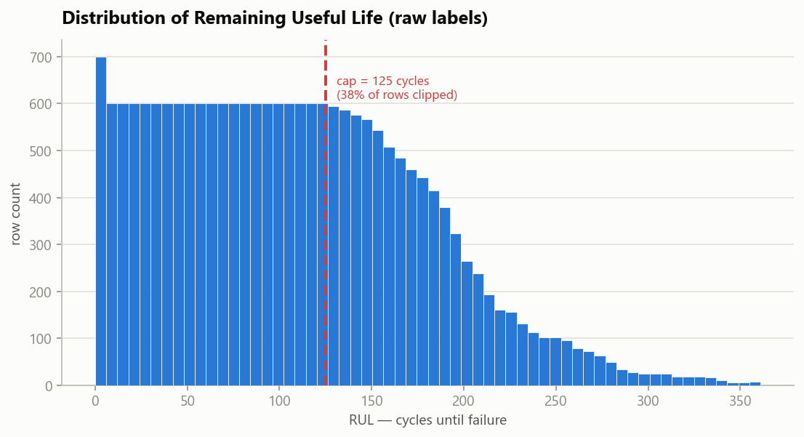

Raw RUL ranges from 0 to 361, but early in an engine's life the exact RUL is
**unpredictable** (a healthy engine looks the same at 300 vs. 250 cycles remaining).
Nearly **39%** of rows sit above 125. We therefore apply the standard **piecewise-linear
cap at 125 cycles** — the model learns to say "plenty of life left" above the cap and
focuses its capacity on the degradation window that actually matters.

### 2. Sensors drift systematically as failure approaches

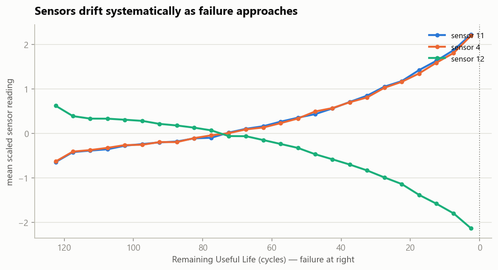

This is *why the problem is learnable*. Averaged across all engines, key sensors move
monotonically as RUL → 0: sensors 11 and 4 climb while sensor 12 falls. The signal is
faint far from failure and grows sharp near it — exactly the regime predictive
maintenance cares about.

### 3. Many features carry a real linear signal

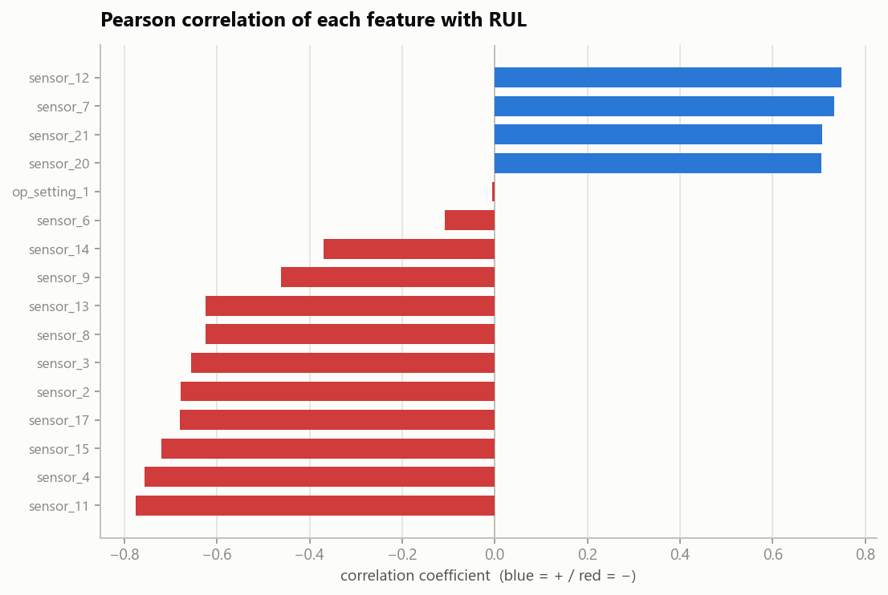

Pearson correlation with RUL confirms the degradation story: several sensors correlate
strongly (positively or negatively) with remaining life, so even a linear baseline has
something to grip. The Random Forest additionally captures **nonlinear** interactions a
correlation can't show.

---

## 🧠 Modeling Approach

### Features & target
- **16 inputs:** `operational_setting_1` + 15 scaled sensors.
- **Target:** RUL, **capped at 125** (piecewise-linear).

### Why an engine-grouped split
A random row-level train/test split would leak: cycles from the *same* engine would
land in both sets, and the model could "memorize" that engine. We use
`GroupShuffleSplit` on `unit_number` (75 train / 25 test engines) so **every test
engine is completely unseen** — the metrics reflect generalization to new hardware.

### How we score a model

| Metric | What it measures | Why we track it |
|---|---|---|
| **MAE** | average absolute error, in cycles | the plain "how far off are we typically?" number |
| **RMSE** | error with large misses squared first | surfaces **rare catastrophic errors** that MAE hides in the average |
| **R²** | share of RUL variance explained | overall goodness of fit |
| **C-MAPSS score** | asymmetric PHM penalty | punishes **late** predictions (engine predicted to last *longer* than it does) far harder than early ones — because in maintenance, late is the dangerous direction |
| **F1 / ROC-AUC** | failure-alarm quality | for the "fails within 30 cycles?" framing |

The **RMSE-minus-MAE gap** is worth watching on its own: a model with a wide gap is
making occasional huge misses, which on a jet engine matters far more than a slightly
worse average.

---

## 🔁 Model Selection: Five Rounds of Training

We did **not** pick a model up front. We ran **five rounds of training**, each one
answering a question the previous round raised, and let the measurements decide. Two of
those rounds were **negative results we kept** — they're the reason the final choice is
defensible. Every model below is still in the repo and still reproducible; this section is
the audit trail.

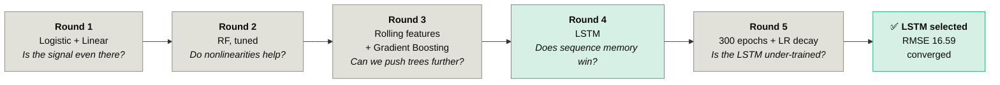

### Round 1 — Linear & Logistic Regression *(the baselines)*
**Question:** is RUL predictable from a single cycle's sensors at all?

`logistic_regression_base.py` frames the same problem two ways on the identical grouped
split — **logistic** classification ("will this engine fail within 30 cycles?") vs.
**linear** regression on capped RUL. Both worked well enough to prove the signal is real
(linear **RMSE 20.55**, logistic **ROC-AUC 0.989**), which justified spending effort on
stronger models. **Kept as the reference floor.**

### Round 2 — Random Forest *(nonlinear, interpretable)*
**Question:** do nonlinear sensor interactions buy us anything?

Yes — **RMSE 20.55 → 18.69**. We also tuned it for deployment: `leaf=10 / 200 trees`
matched a heavier forest's accuracy at ~¼ the pickle size and ~½ the training time,
which is what lets the app train on startup inside free-tier memory.

```python
RandomForestRegressor(
    n_estimators=200,
    min_samples_leaf=10,   # tuned: matches a heavier model's accuracy…
    max_features="sqrt",   # …while cutting pickle size ~4× and train time ~2×
    random_state=42,
    n_jobs=-1,
)
```

### Round 3 — Rolling-window features & Gradient Boosting *(the dead end)*
**Question:** can we squeeze more out of tree models?

**No.** We engineered per-engine rolling mean/std temporal features and tried gradient
boosting. Neither beat the tuned Random Forest — on this dataset and feature set, tree
models plateau around **RMSE 18**. We reported the negative result and kept the simpler,
leaner model.

This round is *why* we moved to a sequence model. The ceiling wasn't the algorithm, it
was the **input representation**: every model so far saw one cycle at a time.

### Round 4 — LSTM *(the winner)*
**Question:** if degradation is a trajectory, does a model with memory beat one without?

**Yes, decisively.** A 2-layer LSTM reading a **30-cycle sliding window** per engine beat
every previous round on every metric. See [Results](#-results).

### Round 5 — Extended training & LR decay *(convergence check)*
**Question:** was Round 4 under-trained — is there more left in the LSTM?

**No.** Round 4 stopped at a 60-epoch cap with the curve looking like it was still
descending, so we re-ran with a **300-epoch budget and `ReduceLROnPlateau`** learning-rate
decay. It early-stopped at epoch 81 having found nothing better: the best checkpoint was
**epoch 56**, already inside the original run.

Test metrics came out **identical to Round 4** — which is the expected result, since
training restores best-validation weights rather than final-epoch weights, and both runs
share a seed. What looked like a still-falling curve at epoch 60 was **noise around a
minimum already reached at epoch 56**.

> **We report 16.59 as a converged result, not a floor.** An earlier draft of this README
> claimed the LSTM was under-trained; Round 5 disproved that, and we corrected it rather
> than leaving the more flattering claim in place. Further gains would need a different
> architecture or window length — not more epochs.

### Making the rounds comparable
`compare_models.py` re-trains **all four models in one script** and enforces three
fairness rules, so the numbers below are a like-for-like fight rather than four separate
experiments quoted next to each other:

| Rule | Why it matters |
|---|---|
| **One engine-grouped split** (seed 42) | No engine appears in both train and test, for any model. |
| **One shared set of evaluation points** | The LSTM needs 30 cycles of history, so it can't score cycles 1–29. Rather than let it skip the hard early cycles the others were charged for, **every model** is scored only on test cycles ≥ 30. |
| **One shared scoreboard** | Logistic outputs a probability, not a cycle count. So every regressor's RUL is also converted to the same "fails within 30 cycles" flag, letting the classifier compete directly. |

We also handicapped the winner on purpose: the LSTM trains on **20% less data** than its
competitors (15 engines held out for early stopping — a knob the sklearn models don't
need). It won anyway.

> Reproduce everything: `python compare_models.py`

---

## 🎯 Results

All results below are on the **25 held-out engines** no model ever saw during training.

### The head-to-head that decided it

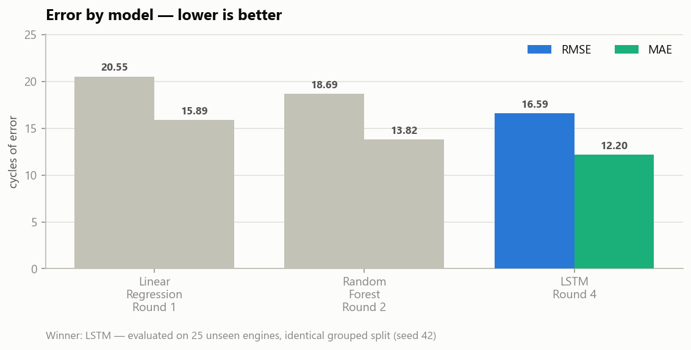

**Predicting RUL in cycles** — lower is better, except R²:

| Round | Model | RMSE ↓ | MAE ↓ | R² ↑ | C-MAPSS ↓ |
|---|---|---:|---:|---:|---:|
| 1 | Linear Regression | 20.55 | 15.89 | 0.758 | 33,565 |
| 2 | Random Forest | 18.69 | 13.82 | 0.800 | 43,450 |
| **4** | **LSTM** | **16.19 ± 0.35** | **11.59 ± 0.53** | **0.850 ± 0.007** | **28,732 ± 2,829** |

> The Linear and Random Forest rows are **exact** — scikit-learn is deterministic given a
> seed, and those figures came back bit-identical on all three machines we tested. The LSTM
> row is a **mean ± standard deviation across three environments**, because neural-network
> training is not bit-reproducible across different CPUs and library versions. See
> **[the reproduction log](docs/reproduction-log.md)** for all three raw runs.

**"Will this engine fail within 30 cycles?"** — higher is better. This is the board that
lets the Round-1 classifier compete:

| Model | Accuracy ↑ | F1 ↑ | ROC-AUC ↑ | PR-AUC ↑ |
|---|---:|---:|---:|---:|
| Logistic Regression | 0.928 | 0.828 | 0.989 | 0.954 |
| Linear → flag | 0.923 | 0.734 | 0.985 | 0.938 |
| Random Forest → flag | 0.953 | 0.857 | 0.988 | 0.953 |
| **LSTM → flag** | **0.967** | **0.906** | **0.992** | **0.973** |

### Why we picked the LSTM — four independent reasons

1. **Lowest error, by a clear margin.** RMSE **16.19** vs. 18.69 (RF) and 20.55 (linear) —
   roughly **4 cycles better than the baseline** and **2.5 better than the Random Forest**.
   Crucially, the margin held on **every** machine we tested: even our *worst* LSTM run
   (16.59) beat the Random Forest by 2.10 cycles.
2. **Fewest catastrophic misses.** The gap between a model's RMSE and MAE reveals hidden
   large errors, because RMSE squares them. LSTM's gap is **4.6**, vs. RF's **4.87** — the
   smallest of the three. On jet engines, one 40-cycle miss matters more than ten 4-cycle
   ones, so this is arguably the most important row here.
3. **Best safety score.** The asymmetric **C-MAPSS score** punishes *late* predictions —
   claiming an engine will last longer than it does — far harder than early ones, because
   late is the dangerous direction. The LSTM beat the Random Forest's **43,450** on all
   three machines, by between **28% and 41%** depending on the environment — call it
   roughly a third better on the metric that encodes real maintenance risk.
4. **Best failure alarm.** F1 **0.905** vs. logistic's 0.828 — when it warns that an
   engine is within 30 cycles of failure, it is right more often *and* misses fewer. This
   was our **most stable** metric across environments (0.904–0.906).

### Why it wins — the mechanism
This isn't "deep learning is magic." It's the input representation:

> Linear, Logistic, and Random Forest each see **one cycle at a time** — a single row of
> 16 sensor readings. The LSTM reads **30 consecutive cycles**, so it can use *how fast*
> the sensors are drifting, not just where they sit right now. Engine degradation is a
> **trajectory, not a snapshot** — and Round 3 proved that no amount of tree tuning fixes
> a snapshot-shaped input.

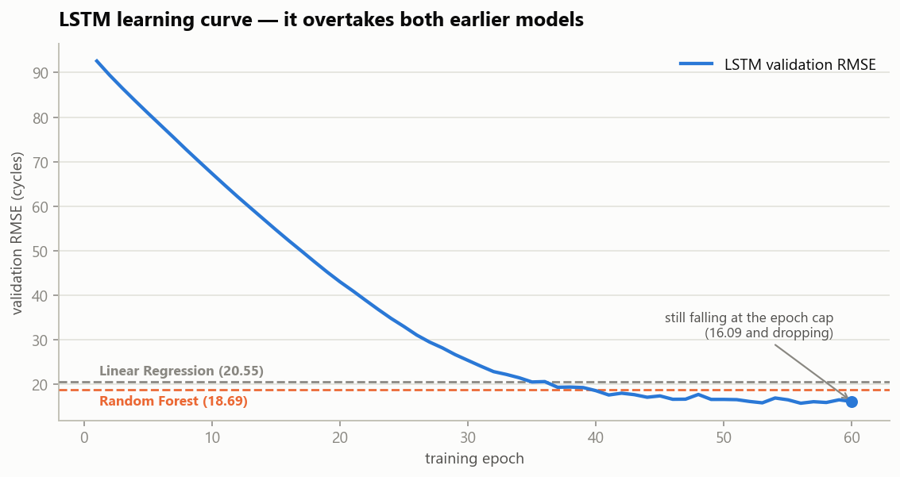

The curve crosses below the Random Forest around **epoch 39** and flattens. The kept model
is the **epoch-56 checkpoint** — training restores best-validation weights, so the final
epoch is not the model.

### Verified on three independent machines

We didn't just report our own run — we re-ran the whole comparison on **Kaggle** and **Google
Colab** as well, on different operating systems, CPUs and library versions.

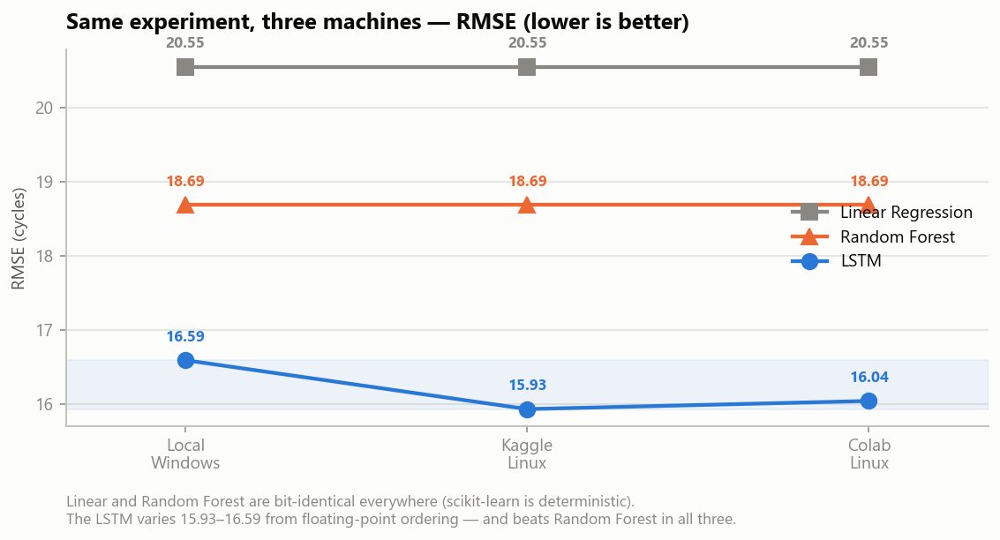

| | Local (Windows) | Kaggle (Linux) | Colab (Linux) |
|---|---:|---:|---:|
| Linear | 20.55 | 20.55 | 20.55 |
| Random Forest | 18.69 | 18.69 | 18.69 |
| LSTM | 16.59 | 15.93 | 16.04 |

Two things came out of this, and we report both:

**The scikit-learn models are bit-identical everywhere** — `20.55` and `18.69` to the decimal,
on every machine. That confirms the dataset, the engine-grouped split and the evaluation
pipeline are genuinely identical across environments.

**The LSTM is not bit-reproducible across machines**, and we don't pretend otherwise. torch's
CPU kernels sum in an order that depends on thread count and instruction width, so tiny
differences appear by epoch 10 and compound; each run settles on a different best checkpoint
(epoch 56 / 62 / 60). This is a known property of neural network training, not a defect —
seeding makes a run repeatable *on one machine*, but cannot make floating-point arithmetic
identical *across* machines. It's why the LSTM row is quoted as a mean ± standard deviation.

**The conclusion survived all three runs.** The ordering LSTM < Random Forest < Linear never
came close to flipping.

> **▶️ Run it yourself:** open the **[Colab notebook](https://colab.research.google.com/drive/1qzrg2iQnuTor42PjmQoMWagofw3uq6xi?usp=sharing)**
> and hit *Runtime → Run all* (~12 min, CPU, no setup). Or run
> [`kaggle_reproduce.py`](kaggle_reproduce.py) anywhere. Both end with a **reproduction check**
> that prints `OK`/`DIFF` per model against the values published here — so verifying this
> README takes no manual comparison. Full logs: **[docs/reproduction-log.md](docs/reproduction-log.md)**.

### The Random Forest in detail
The three figures below profile the Round-2 Random Forest, which remains the model the
**deployed dashboard** currently serves.

> **Note on two different RF numbers.** `save_model.py` reports RF at **RMSE 18.0** over
> *all* test cycles; the comparison table above reports **18.69** because it scores only
> cycles ≥ 30, where the LSTM can also compete. Same model, same split — different
> evaluation subset. We quote both rather than silently picking the flattering one.

### Predicted vs. actual

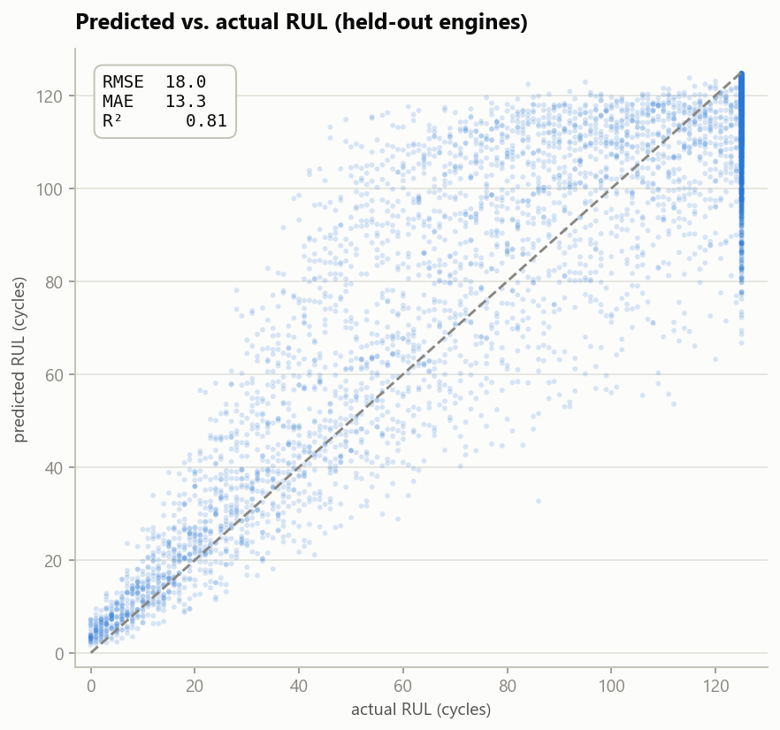

Predictions hug the diagonal, and — crucially for maintenance — **tighten as RUL → 0**,
where accuracy matters most. The dense vertical band at 125 is the RUL cap.

### Error is roughly unbiased

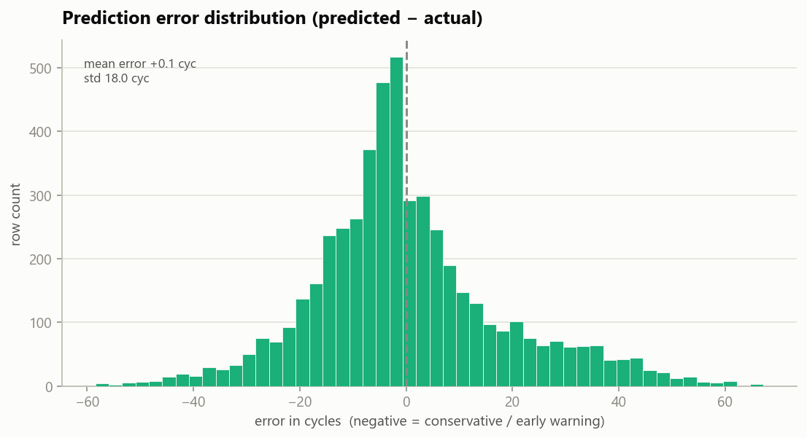

Residuals center near zero with no large systematic bias; the left tail (conservative /
early-warning errors) is the *safer* direction to err in.

### What the model relies on

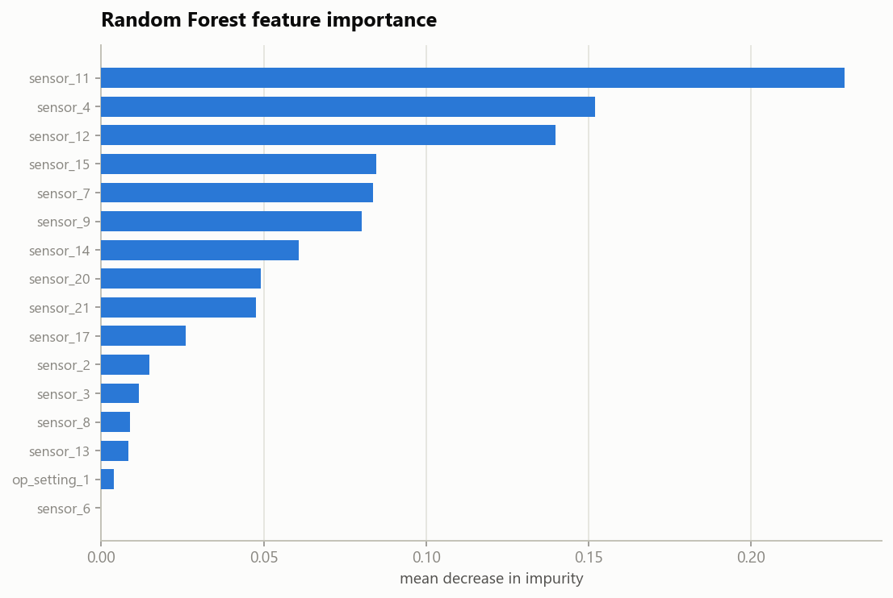

Importance is spread across sensors 11, 4, 12, 15, 7 and 9 rather than dominated by one
— a robust signal, consistent with the degradation and correlation plots above.

### What we tried that *didn't* help
Being honest about the ceiling (this was **Round 3** above): on this dataset and feature
set, tree models top out around **RMSE 18**. We tested **rolling-window temporal
features** (per-engine moving mean/std) and **gradient boosting** — neither beat the
tuned Random Forest, so we kept the simpler, leaner model.

That negative result is what pointed us at Round 4: bolting hand-made temporal features
onto a snapshot model didn't work, but a model that reads the sequence **natively** did.

---

## ⚙️ How the Dashboard Works

All three modes call one function, `predict_rul()` in [`model.py`](model.py):

| Mode | Input | Output |
|---|---|---|
| **Browse engine** | an engine + cycle from the dataset | predicted RUL + sensor charts over its life |
| **Upload CSV** | a pre-scaled CSV with the 16 feature columns | predicted RUL per row + downloadable results |
| **Manual input** | 16 hand-entered scaled values | one prediction + 🟢/🟠/🔴 maintenance flag |

When no pre-trained pickle is present (e.g. a fresh deploy), the app **trains the model
in-process from the committed CSV**, cached via `@st.cache_resource`, and degrades
gracefully to a clearly-labeled placeholder heuristic if training ever fails — so the
app never hard-crashes on the user.

---

## 🚀 Getting Started

### Prerequisites
- Python 3.9+
- `pip`

### Setup
```bash
git clone https://github.com/William-franklyn/Jet-Engine-Predictive-Maintenance-ML.git
cd Jet-Engine-Predictive-Maintenance-ML
pip install -r requirements.txt
```

### Run the dashboard
```bash
# optional: pre-train the model (otherwise the app trains it on first load, ~10s)
python save_model.py

streamlit run app.py
```

### Reproduce the figures in this README
```bash
pip install matplotlib
python scripts/generate_figures.py     # writes docs/images/*.png
```

### Run the baseline comparison
```bash
python logistic_regression_base.py
```

### Reproduce the model selection
Trains Linear, Logistic, Random Forest **and** the LSTM on one shared split and prints
both scoreboards (~10 min on CPU):

```bash
python compare_models.py                      # writes docs/model_comparison_*.csv
python scripts/generate_model_comparison.py   # rebuilds the comparison figures
```

To retrain the **deployed** LSTM (uses all 100 engines, unlike the evaluation model):

```bash
python save_lstm_model.py     # writes lstm_rul_model.pt
```

> **Windows note:** if training segfaults partway through — at a different epoch each run —
> that's a torch/OpenMP threading fault, not a bug. `set OMP_NUM_THREADS=2` fixes it with
> identical results. Linux is unaffected.

### Verify our published numbers
Easiest is the **[Colab notebook](https://colab.research.google.com/drive/1qzrg2iQnuTor42PjmQoMWagofw3uq6xi?usp=sharing)**
(*Runtime → Run all*, ~12 min, no setup). Or locally:

```bash
python kaggle_reproduce.py
```

Either prints a **reproduction check** comparing what you got against what this README claims.

---

## 🗂️ Project Structure

```
Jet-Engine-Predictive-Maintenance-ML/
├── app.py                          # Streamlit dashboard (3 modes)
├── model.py                        # predict_rul(), feature list, model loader
├── model.py                        # predict_rul(), predict_rul_sequence(), loaders
├── save_model.py                   # Round 2 — trains + saves the RF; train_full_model()
├── logistic_regression_base.py     # Round 1 — logistic vs linear on the same split
├── lstm_model.py                   # Round 4 — PyTorch LSTM + sequence windowing
├── save_lstm_model.py              # trains the DEPLOYED LSTM on all 100 engines
├── lstm_rul_model.pt               # the deployed LSTM checkpoint (~220KB, committed)
├── compare_models.py               # the head-to-head benchmark (all 4 models)
├── kaggle_reproduce.py             # self-contained one-file reproduction script
├── scripts/
│   ├── audit_data.py               # data integrity / bias audit (exits 1 on failure)
│   ├── generate_figures.py         # regenerates the EDA / Random Forest figures
│   └── generate_model_comparison.py# regenerates the model-selection figures
├── docs/
│   ├── reproduction-log.md         # all three environments, raw output
│   ├── images/                     # generated charts + dashboard screenshots
│   ├── model_comparison_*.csv      # measured results (written by compare_models.py)
│   └── lstm_training_curve.csv     # LSTM learning curve, logged per epoch
├── nasa_cmapss_FD001_scaled.csv    # the dataset (single source of truth)
├── requirements.txt                # all deps, incl. CPU-only torch
├── README.md
└── CLAUDE.md                       # engineering notes / conventions
```

---

## 🧩 Design Decisions

| Decision | Why |
|---|---|
| **One dataset as the single source of truth** | The whole project (baseline, trainer, all dashboard modes) reads `nasa_cmapss_FD001_scaled.csv`, so it trains and runs with **zero external file dependencies**. |
| **Cap RUL at 125** | Early-life RUL is unpredictable; the piecewise-linear cap focuses the model on the degradation window and is the C-MAPSS convention. |
| **Engine-grouped split** | Prevents leakage — reported metrics reflect *unseen engines*, not memorized ones. |
| **Lean Random Forest** | `leaf=10 / 200 trees` matches a heavier model's accuracy at ¼ the size, so the app can train on startup within free-tier memory. |
| **Train-on-startup, not a committed binary** | Keeps the model in sync with code/data and avoids shipping a large pickle to git. |
| **Graceful degradation** | Any environment/training failure falls back to a placeholder instead of crashing the deployed app. |
| **Model chosen by measurement, not preference** | Five rounds of training on one shared split and one shared scoreboard — including **two negative results we kept** — so "we use an LSTM" is a **conclusion**, not a starting assumption. |
| **Two models in production, routed per prediction** | The LSTM is more accurate but needs 30 cycles of history. Rather than cripple the app or hide the gap, it serves LSTM predictions where history exists and Random Forest where it doesn't — and **labels which**. |
| **CPU-only torch wheel** | Default PyPI `torch` drags in ~2 GB of CUDA libraries the app never uses. Pinning `--extra-index-url .../whl/cpu` keeps the deploy inside free-tier limits. |
| **Verified on three machines** | Publishing numbers only one laptop can produce isn't reproducible. Re-running on Kaggle and Colab exposed that the LSTM varies ±0.35 RMSE across environments — so we report it that way. |

---

## 🔭 Limitations & Future Work

- **Metric scope.** We report error over *all* cycles; the official C-MAPSS benchmark
  scores only the last cycle of each test engine. Our numbers are an honest internal
  metric, not directly comparable to leaderboard RMSE.
- **Single operating condition.** FD001 is the simplest C-MAPSS subset (one condition,
  one fault mode). FD002–FD004 add operating regimes and fault modes.
- **The LSTM is converged, so easy gains are gone.** Round 5 showed more epochs and
  learning-rate decay buy nothing. Further improvement needs a **different architecture or
  window length** — a hyperparameter sweep over window size, hidden units and layer count
  is the honest next step, and we have not run one.
- **Sequence models can't cold-start.** The LSTM needs 30 cycles of history before it can
  predict properly, so a brand-new engine — or a single hand-entered reading — still falls
  back to the Random Forest. The dashboard runs **both** for this reason, but it does mean
  the headline accuracy doesn't apply to every prediction the app makes.
- **Not bit-reproducible across machines.** LSTM RMSE varied 15.93–16.59 over three
  environments. The conclusion is stable; the exact decimal is not. See
  [the reproduction log](docs/reproduction-log.md).
- **One seed.** All results use `random_state=42`, chosen before any modelling and never
  changed. A fuller evaluation would report mean ± std over 3–5 **seeds** (not just three
  machines) to separate a real margin from split luck. We have not run that.
- **The scaler saw the test engines.** The dataset arrived pre-scaled using statistics from all
  100 engines — mild preprocessing leakage. It leaks no labels and affects all four models
  equally, so the comparison stands, but absolute errors may be marginally optimistic. Full
  detail in the [Data Audit](#-data-audit).
- **One fault mode, one operating condition, simulated data.** FD001 covers HPC degradation at
  a single operating regime, generated by a NASA simulator. The model would be **blind** to a
  fan or bearing failure — not merely inaccurate, but reporting a healthy engine. This is a
  demonstration that sequence models beat snapshot models, **not an airworthy system**.
- **Scaling assumptions.** The app expects inputs pre-scaled with the same statistics as
  training; a productionized version would bundle the scaler.

---

## 👥 The Team

This project is a **team achievement of AI4ALL Ignite — Team 04C**. Built collaboratively
by:

| | | |
|---|---|---|
| **William Frank Mahunda** | **Tom Chatto** | **Gabe Meredith** |
| **Nish Methuku** | **Erronn Bridgewater** | **Hunter Ngo** |

From data preprocessing and exploratory analysis to modeling, evaluation, and the
deployed dashboard — every piece came together through the group's shared work during
the AI4ALL Ignite program. 💙

---

## 🙏 Acknowledgments & References

- **AI4ALL Ignite** — for the program, mentorship, and framing around responsible AI.
- **NASA Prognostics Center of Excellence** — *C-MAPSS Turbofan Engine Degradation
  Simulation Data Set* (FD001). A. Saxena, K. Goebel, D. Simon, and N. Eklund,
  "Damage propagation modeling for aircraft engine run-to-failure simulation," *2008
  International Conference on Prognostics and Health Management*.
- **scikit-learn**, **Streamlit**, **pandas**, **NumPy**, **Matplotlib** — the open-source
  stack this project is built on.

---

<div align="center">
<sub>Built with 💙 by AI4ALL Ignite Team 04C · Predicting jet engine failure to make maintenance smarter and flights safer.</sub>
</div>
