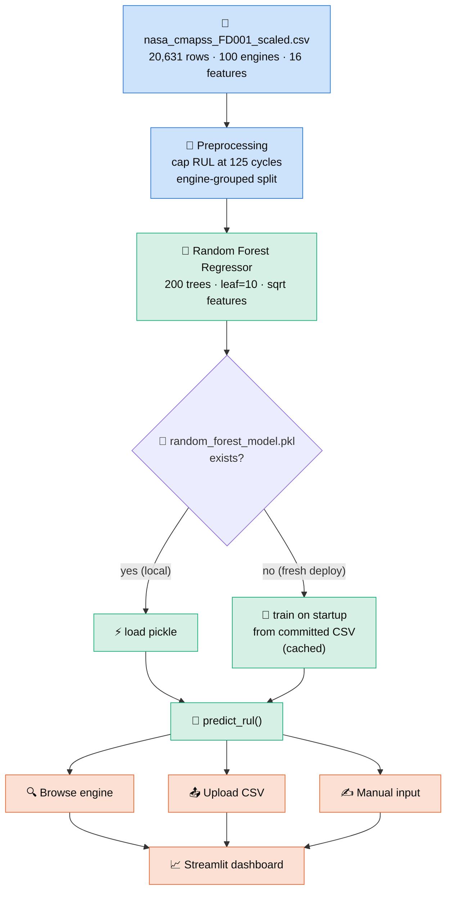
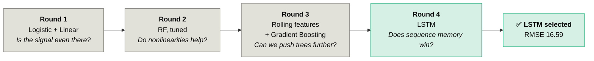

# ✈️ Turbofan Engine RUL Predictor
### Predicting Jet Engine Failure Through Machine Learning


> An **AI4ALL Ignite** group project by **Team 04C**. We train a model on turbofan
> sensor telemetry to predict a jet engine's **Remaining Useful Life (RUL)** — how
> many flight cycles remain before failure — so airlines can move from *fixed*
> replacement schedules to **predictive maintenance**.

**🔗 Live app:** **[jet-engineml.streamlit.app](https://jet-engineml.streamlit.app)**

**🏆 Best model:** **LSTM** — **RMSE 16.59 / MAE 12.20 / R² 0.842** on unseen engines,
selected over Linear Regression, Logistic Regression and Random Forest across
**[four documented rounds of training](#-model-selection-four-rounds-of-training)**
&nbsp;·&nbsp; **📊 Currently deployed:** Random Forest (RMSE 18.0)

---

## 📑 Table of Contents

1. [The Problem](#-the-problem)
2. [Dashboard](#-dashboard)
3. [System Architecture](#-system-architecture)
4. [The Dataset](#-the-dataset)
5. [Exploratory Data Analysis](#-exploratory-data-analysis)
6. [Modeling Approach](#-modeling-approach)
7. [Model Selection: Four Rounds of Training](#-model-selection-four-rounds-of-training)
8. [Results](#-results)
9. [How the Dashboard Works](#-how-the-dashboard-works)
10. [Getting Started](#-getting-started)
11. [Project Structure](#-project-structure)
12. [Design Decisions](#-design-decisions)
13. [Limitations & Future Work](#-limitations--future-work)
14. [The Team](#-the-team)
15. [Acknowledgments & References](#-acknowledgments--references)

---

## 🛩️ The Problem

Jet engines are today maintained on **fixed schedules** — replaced or serviced after
a set number of flight cycles, whether or not they actually need it. That is safe but
wasteful: healthy engines get pulled early, and the occasional engine degrades faster
than the schedule assumes.

**Research question:** *Can machine learning predict early engine failure from sensor
telemetry, to support predictive maintenance and reduce unexpected downtime?*

If we can estimate an engine's **Remaining Useful Life (RUL)** — the number of flight
cycles left before failure — from its sensors, maintenance can be scheduled *per
engine, by condition*, instead of by a one-size-fits-all calendar. This project builds
that estimator and wraps it in an interactive dashboard.

---

## 🖥️ Dashboard

The Streamlit app has three modes, all backed by the same trained model.

> ### ▶️ **[Try it live → jet-engineml.streamlit.app](https://jet-engineml.streamlit.app)**
> The deployed dashboard trains its model on startup from the committed dataset — no
> setup required.

### 1. Browse engine
Pick one of the 100 training engines and scrub through its life cycle by cycle, watching
its predicted RUL update. Below, engine 1 at its final cycle (192) is correctly predicted
at just **4 cycles** of life remaining:


The sensor charts show the characteristic upward drift near failure — the degradation
signal the model keys on:


### 2. Upload CSV
Upload pre-scaled sensor readings; the app validates the 16 required columns and previews
the data:


…then returns a predicted RUL for every row, downloadable as a results CSV:


### 3. Manual input
Hand-enter a single engine's 16 sensor/setting values for an instant prediction with a
color-coded maintenance recommendation (🟢 healthy / 🟠 inspect / 🔴 maintenance soon):


---

## 🏗️ System Architecture



**The key architectural decision** is that the app is **self-sufficient**: the trained
model pickle is ~28 MB and *not* committed (it exceeds GitHub limits when large, and
would drift from the code). Instead, on a fresh cloud deployment the app **trains the
model once on startup** from the committed dataset and caches it. No external files, no
manual steps — clone and run.

---

## 📊 The Dataset

We use **NASA's C-MAPSS FD001** turbofan degradation dataset — a standard
run-to-failure benchmark in prognostics. Each engine runs from healthy operation until
failure, logging sensor readings every flight cycle.

| Property | Value |
|---|---|
| Rows (engine-cycles) | **20,631** |
| Engines (units) | **100** |
| Cycles per engine | 128 – 362 |
| Model features | **16** (1 operational setting + 15 sensors) |
| Target | `RUL` — cycles until failure |
| Scaling | all features **z-score standardized** (not raw physical units) |

### Data dictionary

| Column | Meaning |
|---|---|
| `unit_number` | Engine ID (1–100) |
| `time_in_cycles` | Flight cycle index for that engine |
| `operational_setting_1` | Flight-condition setting (scaled) |
| `sensor_2 … sensor_21` | 15 retained sensor channels (scaled): temperatures, pressures, fan/core speeds, flow ratios |
| `RUL` | **Target** — remaining useful life in cycles |

> ⚠️ **Values are z-scored**, so a reading of `1.4` means "1.4 standard deviations
> above the fleet mean," *not* a temperature or pressure. All UI copy says "scaled
> sensor reading" rather than °F/psi. Uninformative/constant FD001 channels (sensors
> 1, 5, 10, 16, 18, 19) were dropped upstream.

---

## 🔬 Exploratory Data Analysis

### 1. The target is skewed — which motivates a cap


Raw RUL ranges from 0 to 361, but early in an engine's life the exact RUL is
**unpredictable** (a healthy engine looks the same at 300 vs. 250 cycles remaining).
Nearly **39%** of rows sit above 125. We therefore apply the standard **piecewise-linear
cap at 125 cycles** — the model learns to say "plenty of life left" above the cap and
focuses its capacity on the degradation window that actually matters.

### 2. Sensors drift systematically as failure approaches


This is *why the problem is learnable*. Averaged across all engines, key sensors move
monotonically as RUL → 0: sensors 11 and 4 climb while sensor 12 falls. The signal is
faint far from failure and grows sharp near it — exactly the regime predictive
maintenance cares about.

### 3. Many features carry a real linear signal


Pearson correlation with RUL confirms the degradation story: several sensors correlate
strongly (positively or negatively) with remaining life, so even a linear baseline has
something to grip. The Random Forest additionally captures **nonlinear** interactions a
correlation can't show.

---

## 🧠 Modeling Approach

### Features & target
- **16 inputs:** `operational_setting_1` + 15 scaled sensors.
- **Target:** RUL, **capped at 125** (piecewise-linear).

### Why an engine-grouped split
A random row-level train/test split would leak: cycles from the *same* engine would
land in both sets, and the model could "memorize" that engine. We use
`GroupShuffleSplit` on `unit_number` (75 train / 25 test engines) so **every test
engine is completely unseen** — the metrics reflect generalization to new hardware.

### How we score a model

| Metric | What it measures | Why we track it |
|---|---|---|
| **MAE** | average absolute error, in cycles | the plain "how far off are we typically?" number |
| **RMSE** | error with large misses squared first | surfaces **rare catastrophic errors** that MAE hides in the average |
| **R²** | share of RUL variance explained | overall goodness of fit |
| **C-MAPSS score** | asymmetric PHM penalty | punishes **late** predictions (engine predicted to last *longer* than it does) far harder than early ones — because in maintenance, late is the dangerous direction |
| **F1 / ROC-AUC** | failure-alarm quality | for the "fails within 30 cycles?" framing |

The **RMSE-minus-MAE gap** is worth watching on its own: a model with a wide gap is
making occasional huge misses, which on a jet engine matters far more than a slightly
worse average.

---

## 🔁 Model Selection: Four Rounds of Training

We did **not** pick a model up front. We ran **four rounds of training**, each one
answering a question the previous round raised, and let the measurements decide. Every
model below is still in the repo and still reproducible — this section is the audit
trail.



### Round 1 — Linear & Logistic Regression *(the baselines)*
**Question:** is RUL predictable from a single cycle's sensors at all?

`logistic_regression_base.py` frames the same problem two ways on the identical grouped
split — **logistic** classification ("will this engine fail within 30 cycles?") vs.
**linear** regression on capped RUL. Both worked well enough to prove the signal is real
(linear **RMSE 20.55**, logistic **ROC-AUC 0.989**), which justified spending effort on
stronger models. **Kept as the reference floor.**

### Round 2 — Random Forest *(nonlinear, interpretable)*
**Question:** do nonlinear sensor interactions buy us anything?

Yes — **RMSE 20.55 → 18.69**. We also tuned it for deployment: `leaf=10 / 200 trees`
matched a heavier forest's accuracy at ~¼ the pickle size and ~½ the training time,
which is what lets the app train on startup inside free-tier memory.

```python
RandomForestRegressor(
    n_estimators=200,
    min_samples_leaf=10,   # tuned: matches a heavier model's accuracy…
    max_features="sqrt",   # …while cutting pickle size ~4× and train time ~2×
    random_state=42,
    n_jobs=-1,
)
```

### Round 3 — Rolling-window features & Gradient Boosting *(the dead end)*
**Question:** can we squeeze more out of tree models?

**No.** We engineered per-engine rolling mean/std temporal features and tried gradient
boosting. Neither beat the tuned Random Forest — on this dataset and feature set, tree
models plateau around **RMSE 18**. We reported the negative result and kept the simpler,
leaner model.

This round is *why* we moved to a sequence model. The ceiling wasn't the algorithm, it
was the **input representation**: every model so far saw one cycle at a time.

### Round 4 — LSTM *(the winner)*
**Question:** if degradation is a trajectory, does a model with memory beat one without?

**Yes, decisively.** A 2-layer LSTM reading a **30-cycle sliding window** per engine beat
every previous round on every metric. See [Results](#-results).

### Making the four rounds comparable
`compare_models.py` re-trains **all four models in one script** and enforces three
fairness rules, so the numbers below are a like-for-like fight rather than four separate
experiments quoted next to each other:

| Rule | Why it matters |
|---|---|
| **One engine-grouped split** (seed 42) | No engine appears in both train and test, for any model. |
| **One shared set of evaluation points** | The LSTM needs 30 cycles of history, so it can't score cycles 1–29. Rather than let it skip the hard early cycles the others were charged for, **every model** is scored only on test cycles ≥ 30. |
| **One shared scoreboard** | Logistic outputs a probability, not a cycle count. So every regressor's RUL is also converted to the same "fails within 30 cycles" flag, letting the classifier compete directly. |

We also handicapped the winner on purpose: the LSTM trains on **20% less data** than its
competitors (15 engines held out for early stopping — a knob the sklearn models don't
need). It won anyway.

> Reproduce everything: `python compare_models.py`

---

## 🎯 Results

All results below are on the **25 held-out engines** no model ever saw during training.

### The head-to-head that decided it


**Predicting RUL in cycles** — lower is better, except R²:

| Round | Model | RMSE ↓ | MAE ↓ | R² ↑ | C-MAPSS ↓ |
|---|---|---:|---:|---:|---:|
| 1 | Linear Regression | 20.55 | 15.89 | 0.758 | 33,565 |
| 2 | Random Forest | 18.69 | 13.82 | 0.800 | 43,450 |
| **4** | **LSTM** | **16.59** | **12.20** | **0.842** | **25,629** |

**"Will this engine fail within 30 cycles?"** — higher is better. This is the board that
lets the Round-1 classifier compete:

| Model | Accuracy ↑ | F1 ↑ | ROC-AUC ↑ | PR-AUC ↑ |
|---|---:|---:|---:|---:|
| Logistic Regression | 0.928 | 0.828 | 0.989 | 0.954 |
| Linear → flag | 0.923 | 0.734 | 0.985 | 0.938 |
| Random Forest → flag | 0.953 | 0.857 | 0.988 | 0.953 |
| **LSTM → flag** | **0.967** | **0.906** | **0.992** | **0.973** |

### Why we picked the LSTM — four independent reasons

1. **Lowest error, by a clear margin.** RMSE **16.59** vs. 18.69 (RF) and 20.55 (linear).
   That's **~4 cycles better than the baseline** and **~2.1 better than the Random
   Forest** — not a rounding-error win.
2. **Fewest catastrophic misses.** The gap between a model's RMSE and MAE reveals hidden
   large errors, because RMSE squares them. LSTM's gap is **4.39**, vs. RF's **4.87** and
   linear's **4.66** — the *smallest* of the three. On jet engines, one 40-cycle miss
   matters more than ten 4-cycle ones, so this is arguably the most important row here.
3. **Best safety score.** The asymmetric **C-MAPSS score** punishes *late* predictions —
   claiming an engine will last longer than it does — far harder than early ones, because
   late is the dangerous direction. LSTM scores **25,629** vs. RF's **43,450**: it is
   **~41% safer** on the metric that encodes real maintenance risk.
4. **Best failure alarm.** F1 **0.906** vs. logistic's 0.828 — when it warns that an
   engine is within 30 cycles of failure, it is right more often *and* misses fewer.

### Why it wins — the mechanism
This isn't "deep learning is magic." It's the input representation:

> Linear, Logistic, and Random Forest each see **one cycle at a time** — a single row of
> 16 sensor readings. The LSTM reads **30 consecutive cycles**, so it can use *how fast*
> the sensors are drifting, not just where they sit right now. Engine degradation is a
> **trajectory, not a snapshot** — and Round 3 proved that no amount of tree tuning fixes
> a snapshot-shaped input.


The learning curve also shows the LSTM **was still improving when it hit the 60-epoch
cap** — early stopping never triggered. We report **16.59 as a floor, not a ceiling.**

### The Random Forest in detail
The three figures below profile the Round-2 Random Forest, which remains the model the
**deployed dashboard** currently serves.

> **Note on two different RF numbers.** `save_model.py` reports RF at **RMSE 18.0** over
> *all* test cycles; the comparison table above reports **18.69** because it scores only
> cycles ≥ 30, where the LSTM can also compete. Same model, same split — different
> evaluation subset. We quote both rather than silently picking the flattering one.

### Predicted vs. actual


Predictions hug the diagonal, and — crucially for maintenance — **tighten as RUL → 0**,
where accuracy matters most. The dense vertical band at 125 is the RUL cap.

### Error is roughly unbiased


Residuals center near zero with no large systematic bias; the left tail (conservative /
early-warning errors) is the *safer* direction to err in.

### What the model relies on


Importance is spread across sensors 11, 4, 12, 15, 7 and 9 rather than dominated by one
— a robust signal, consistent with the degradation and correlation plots above.

### What we tried that *didn't* help
Being honest about the ceiling (this was **Round 3** above): on this dataset and feature
set, tree models top out around **RMSE 18**. We tested **rolling-window temporal
features** (per-engine moving mean/std) and **gradient boosting** — neither beat the
tuned Random Forest, so we kept the simpler, leaner model.

That negative result is what pointed us at Round 4: bolting hand-made temporal features
onto a snapshot model didn't work, but a model that reads the sequence **natively** did.

---

## ⚙️ How the Dashboard Works

All three modes call one function, `predict_rul()` in [`model.py`](model.py):

| Mode | Input | Output |
|---|---|---|
| **Browse engine** | an engine + cycle from the dataset | predicted RUL + sensor charts over its life |
| **Upload CSV** | a pre-scaled CSV with the 16 feature columns | predicted RUL per row + downloadable results |
| **Manual input** | 16 hand-entered scaled values | one prediction + 🟢/🟠/🔴 maintenance flag |

When no pre-trained pickle is present (e.g. a fresh deploy), the app **trains the model
in-process from the committed CSV**, cached via `@st.cache_resource`, and degrades
gracefully to a clearly-labeled placeholder heuristic if training ever fails — so the
app never hard-crashes on the user.

---

## 🚀 Getting Started

### Prerequisites
- Python 3.9+
- `pip`

### Setup
```bash
git clone https://github.com/William-franklyn/Jet-Engine-Predictive-Maintenance-ML.git
cd Jet-Engine-Predictive-Maintenance-ML
pip install -r requirements.txt
```

### Run the dashboard
```bash
# optional: pre-train the model (otherwise the app trains it on first load, ~10s)
python save_model.py

streamlit run app.py
```

### Reproduce the figures in this README
```bash
pip install matplotlib
python scripts/generate_figures.py     # writes docs/images/*.png
```

### Run the baseline comparison
```bash
python logistic_regression_base.py
```

### Reproduce the four-round model selection
Trains Linear, Logistic, Random Forest **and** the LSTM on one shared split and prints
both scoreboards (~10 min on CPU):

```bash
pip install -r requirements-lstm.txt     # torch — kept separate, see below
python compare_models.py                 # writes docs/model_comparison_*.csv
python scripts/generate_model_comparison.py   # rebuilds the comparison figures
```

> **Why torch is in a separate requirements file:** it's a ~200 MB install and the
> deployed dashboard never imports it. Keeping it out of `requirements.txt` is what keeps
> the Streamlit Cloud deployment inside free-tier limits.

---

## 🗂️ Project Structure

```
Jet-Engine-Predictive-Maintenance-ML/
├── app.py                          # Streamlit dashboard (3 modes)
├── model.py                        # predict_rul(), feature list, model loader
├── save_model.py                   # Round 2 — trains + saves the RF; train_full_model()
├── logistic_regression_base.py     # Round 1 — logistic vs linear on the same split
├── lstm_model.py                   # Round 4 — PyTorch LSTM + sequence windowing
├── compare_models.py               # the four-round head-to-head benchmark
├── scripts/
│   ├── generate_figures.py         # regenerates the EDA / Random Forest figures
│   └── generate_model_comparison.py# regenerates the model-selection figures
├── docs/
│   ├── images/                     # generated charts + dashboard screenshots
│   ├── model_comparison_*.csv      # measured results (written by compare_models.py)
│   └── lstm_training_curve.csv     # LSTM learning curve, logged per epoch
├── nasa_cmapss_FD001_scaled.csv    # the dataset (single source of truth)
├── requirements.txt                # app + sklearn deps (no torch — see Getting Started)
├── requirements-lstm.txt           # torch, for the LSTM experiment only
├── README.md
└── CLAUDE.md                       # engineering notes / conventions
```

---

## 🧩 Design Decisions

| Decision | Why |
|---|---|
| **One dataset as the single source of truth** | The whole project (baseline, trainer, all dashboard modes) reads `nasa_cmapss_FD001_scaled.csv`, so it trains and runs with **zero external file dependencies**. |
| **Cap RUL at 125** | Early-life RUL is unpredictable; the piecewise-linear cap focuses the model on the degradation window and is the C-MAPSS convention. |
| **Engine-grouped split** | Prevents leakage — reported metrics reflect *unseen engines*, not memorized ones. |
| **Lean Random Forest** | `leaf=10 / 200 trees` matches a heavier model's accuracy at ¼ the size, so the app can train on startup within free-tier memory. |
| **Train-on-startup, not a committed binary** | Keeps the model in sync with code/data and avoids shipping a large pickle to git. |
| **Graceful degradation** | Any environment/training failure falls back to a placeholder instead of crashing the deployed app. |
| **Model chosen by measurement, not preference** | Four rounds of training on one shared split and one shared scoreboard — including a negative result we kept — so "we use an LSTM" is a **conclusion**, not a starting assumption. |
| **torch isolated in `requirements-lstm.txt`** | The LSTM is the best model but a ~200 MB dependency; keeping it out of the app's requirements preserves the free-tier deployment. |

---

## 🔭 Limitations & Future Work

- **Metric scope.** We report error over *all* cycles; the official C-MAPSS benchmark
  scores only the last cycle of each test engine. Our numbers are an honest internal
  metric, not directly comparable to leaderboard RMSE.
- **Single operating condition.** FD001 is the simplest C-MAPSS subset (one condition,
  one fault mode). FD002–FD004 add operating regimes and fault modes.
- **The LSTM is under-trained.** It hit the 60-epoch cap with validation RMSE still
  falling, so **16.59 is a floor, not its ceiling.** A longer schedule and a hyperparameter
  sweep (window length, hidden size, learning rate) are the obvious next gains.
- **The dashboard still serves the Random Forest.** Round 4 changed which model is *best*,
  not yet which model is *deployed*; wiring the LSTM into `predict_rul()` is the next
  engineering step, and it means shipping torch to the deploy environment.
- **Sequence models can't cold-start.** The LSTM needs 30 cycles of history before it can
  predict at all, so for a brand-new engine the Random Forest remains the only option.
  A production system would likely run **both**.
- **Scaling assumptions.** The app expects inputs pre-scaled with the same statistics as
  training; a productionized version would bundle the scaler.

---

## 👥 The Team

This project is a **team achievement of AI4ALL Ignite — Team 04C**. Built collaboratively
by:

| | | |
|---|---|---|
| **William Frank Mahunda** | **Tom Chatto** | **Gabe Meredith** |
| **Nish Methuku** | **Alejandro Hernandez** | **Erronn Bridgewater** |
| **Hunter Ngo** | | |

From data preprocessing and exploratory analysis to modeling, evaluation, and the
deployed dashboard — every piece came together through the group's shared work during
the AI4ALL Ignite program. 💙

---

## 🙏 Acknowledgments & References

- **AI4ALL Ignite** — for the program, mentorship, and framing around responsible AI.
- **NASA Prognostics Center of Excellence** — *C-MAPSS Turbofan Engine Degradation
  Simulation Data Set* (FD001). A. Saxena, K. Goebel, D. Simon, and N. Eklund,
  "Damage propagation modeling for aircraft engine run-to-failure simulation," *2008
  International Conference on Prognostics and Health Management*.
- **scikit-learn**, **Streamlit**, **pandas**, **NumPy**, **Matplotlib** — the open-source
  stack this project is built on.

---

<div align="center">
<sub>Built with 💙 by AI4ALL Ignite Team 04C · Predicting jet engine failure to make maintenance smarter and flights safer.</sub>
</div>
